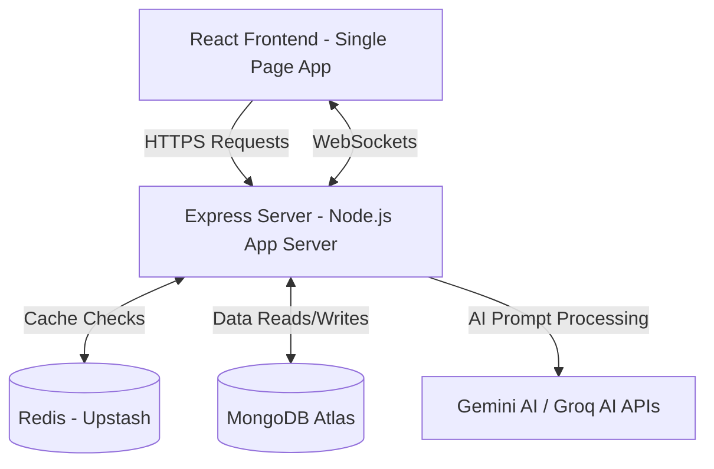
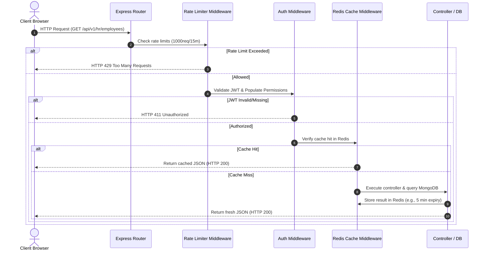
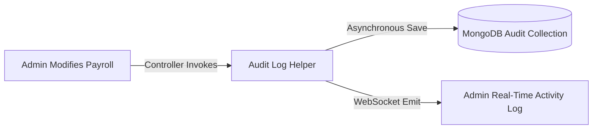

# System Architecture & Technical Flow

This document details the software architecture, data flows, and technical design patterns implemented across the **Enterprise Workforce Management (EWM)** system.

---

## 1. High-Level Architecture

EWM follows a modular **Client-Server** architecture. The application separates concerns between a single-page React client (UI) and a stateless Node.js Express server (API), with Redis providing a high-speed caching tier.

---

## 2. Frontend Architecture

The frontend is structured to be modular and feature-centric. 

### Core Pillars
1. **Routing (`src/App.jsx`)**: Declares all routes using `react-router-dom`. Protected routes are wrapped in an `<AuthGuard>` component to prevent unauthenticated access.
2. **Layouts (`src/layouts/`)**: Provides general visual containers (e.g., `MainLayout`, which includes the global sidebar and navbar, and `AuthLayout` for login pages).
3. **Features (`src/features/`)**: Self-contained directories containing components, pages, services, and CSS specific to a business domain.
4. **API Service Client**: Relies on a global Axios instance (`src/shared/api.js` or feature-level service wrappers) configured with request/response interceptors to attach authorization headers and normalize API errors.

---

## 3. Backend Architecture

The backend follows the MVC (Model-View-Controller) pattern, adapted for RESTful JSON APIs.

### Request-Response Flow

### Routing and Middleware Layers
Every route mounted in `app.js` runs through a pipeline of middlewares before executing business logic:
* **Rate Limiter**: Blocks malicious brute-force attempts.
* **Helmet**: Sets secure HTTP response headers.
* **Express static**: Mounts public file access to the `/uploads` directory (for uploaded profile pictures and documents).
* **`protect` Middleware**: Inspects the incoming `Authorization: Bearer <JWT>` header, decodes the token, loads the user object, flattens permission flags from all assigned user roles, and attaches it to `req.user`.
* **`requirePermission` / `authorize` Middleware**: Asserts that the authenticated user possesses the specific permissions or legacy roles required for the target route.
* **`cache` Middleware**: Dynamically retrieves data from Redis if it has been requested recently, preventing database load.

---

## 4. Real-Time WebSockets Engine

To ensure real-time collaboration across the enterprise, EWM integrates **Socket.io**.

* **Connection**: During client initialization, the browser opens a persistent WebSocket connection to the backend.
* **Authentication**: The JWT is passed during the handshake to map connection socket IDs to specific employee IDs.
* **Events**:
  * **Leave Submissions**: Triggers instant notifications on the assigned manager's HR portal.
  * **IT Helpdesk Ticket Comments**: Emits updates to all involved developers and assignees on the ticket page.
  * **System Announcements**: Broadcasts alerts to all active online employees globally.

---

## 5. Audit Logging Architecture

EWM enforces strict administrative tracking via an **Audit Logging** system.

Whenever sensitive actions are taken (such as modifying payroll, editing an employee profile, or assigning system assets), a custom Mongoose pre-save hook or a dedicated controller helper records the event to the `Audit` collection:

Each log preserves:
* **Actor**: The `userId` and `name` of the administrator who performed the operation.
* **Module**: The name of the affected feature (e.g., `Payroll`, `Assets`).
* **Action**: The action name (`CREATE`, `UPDATE`, `DELETE`, `ARCHIVE`).
* **Metadata**: A JSON block containing the old state and new state of the entity.
* **Timestamp**: Exact server-recorded datetime.
