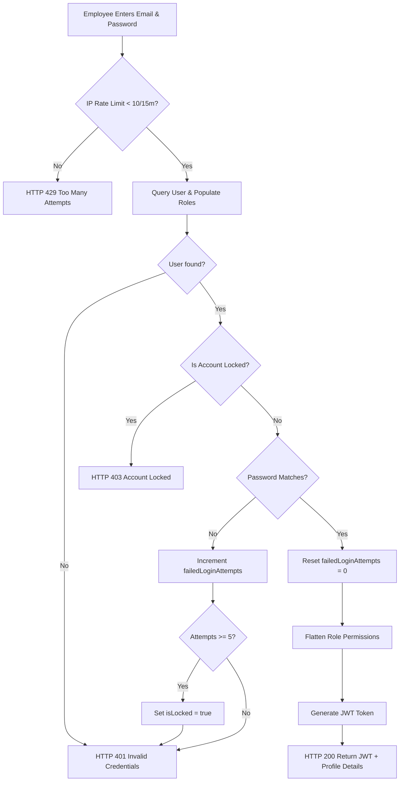

# Authentication Flow

This document details the authentication infrastructure, token validation, secure password storage, account lockout protection, and system impersonation features.

---

## 1. Credentials Hashing & Storage

User credentials are stored securely in the `User` collection. 
* **Hashing Algorithm**: Bcrypt (configured with a work factor of 10 salt rounds).
* **Implementation**: Managed via a Mongoose pre-save schema middleware hook. 
* **Password Verification**: Handled asynchronously via a schema method:

```javascript
UserSchema.methods.comparePassword = async function(candidatePassword) {
    return await bcrypt.compare(candidatePassword, this.password);
};
```

---

## 2. Dynamic Login & Account Lockout Flow

EWM implements strict brute-force protection to secure employee log-ins:



---

## 3. JWT Security & Generation

* **Signature**: Tokens are signed using the backend's secret key (`process.env.JWT_SECRET`) using the standard **HS256** algorithm.
* **Payload Claims**:
  * `id`: The User ID (`_id`).
  * `role`: The primary user role string (for legacy backwards compatibility).
* **Expiration**: Configured via `process.env.JWT_EXPIRES_IN` (defaults to `1d`).

---

## 4. Frontend Authentication Management

When a user logs in successfully, the React client stores the following variables in the browser's **localStorage**:
* `userToken`: The signed JWT string sent by the API.
* `userRole`: The legacy primary string role.
* `userPermissions`: Array of active permission flags (used for rendering UI controls).

Every outgoing API call uses a custom Axios request interceptor to automatically attach the token:

```javascript
// Example from src/shared/api.js or equivalent
axios.interceptors.request.use(config => {
    const token = localStorage.getItem('userToken');
    if (token) {
        config.headers.Authorization = `Bearer ${token}`;
    }
    return config;
});
```

---

## 5. Administrative User Impersonation

For testing and administrative review, Super Admins can assume the identity of any active user.

* **API Endpoint**: `POST /api/v1/auth/admin/impersonate/:userId`
* **Access Control**: Limited strictly to authenticated users whose `role` resolves to `SUPER_ADMIN`.
* **Flow**:
  1. Verify the requester's `SUPER_ADMIN` authorization.
  2. Locate the target user by `:userId`.
  3. Generate a fresh JWT signed with the target user's ID and role credentials.
  4. Return the new JWT to the browser.
  5. The React client replaces the `userToken` in `localStorage` and triggers a full page refresh, loading the assumed user's layout.
* **Security**: This action is logged instantly to the `Audit` collection (`Action: IMPERSONATE_USER`) to prevent administrative abuse.
