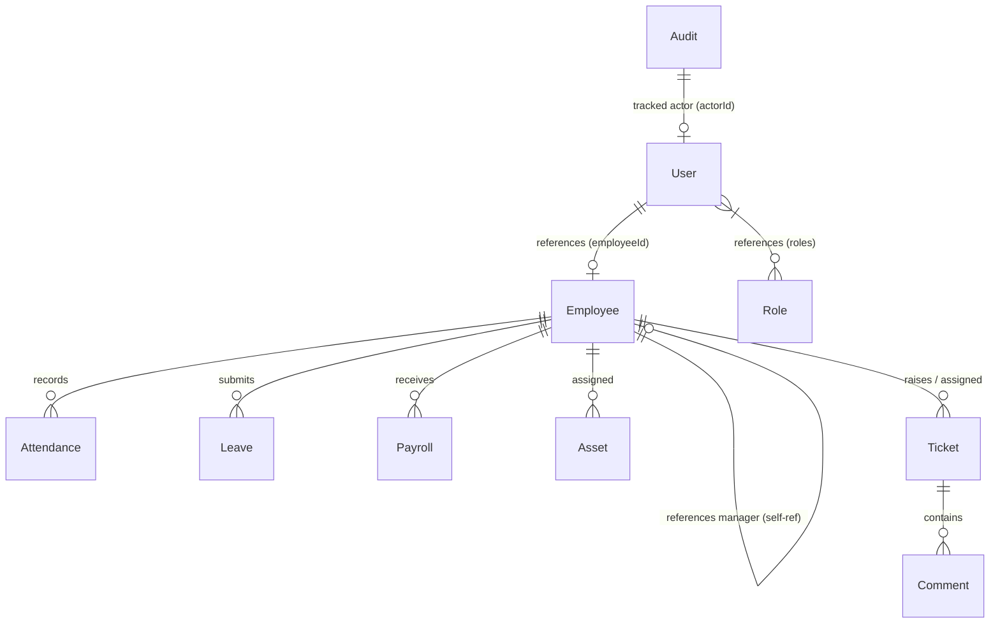

# Database Schema & Data Models

The **Enterprise Workforce Management (EWM)** system utilizes a document-oriented database architecture powered by **MongoDB** (accessed via the **Mongoose ODM**). 

---

## 1. Entity-Relationship Diagram (ERD)

The diagram below illustrates the logical schemas and relationships between the primary collections:

---

## 2. Key Collections & Models

### 👤 User Collection (`User` Model)
Represents login credentials, active roles, and account security locks.
* **File Path**: [user.model.js](file:///e:/Enterprise%20Workforce%20Management/backend/src/modules/auth/user.model.js)
* **Fields**:
  * `email` (String, unique, lowercase, required): Employee corporate login email.
  * `password` (String, required, select: false): Bcrypt-hashed password.
  * `role` (String, enum, default: 'EMPLOYEE'): Legacy role string (e.g. `SUPER_ADMIN`, `FINANCE`, `HR_MANAGER`).
  * `roles` (Array of ObjectIds, ref: `Role`): Pointer to modern role records.
  * `employeeId` (String): Links the user record to the corresponding profile in the `Employee` collection.
  * `isLocked` (Boolean, default: false): Locks account after excessive failed logins.
  * `failedLoginAttempts` (Number, default: 0): Tracks brute-force protection thresholds.

### 💼 Employee Collection (`Employee` Model)
Primary workforce profiles containing directories, bio data, and training records.
* **File Path**: [employee.model.js](file:///e:/Enterprise%20Workforce%20Management/backend/src/modules/hr/employee.model.js)
* **Fields**:
  * `employeeId` (String, unique, required): Internal ID code (e.g. `EWM-1002`).
  * `name` (String, required): Employee full name.
  * `email` (String, unique, lowercase, required): Personal corporate email.
  * `mobile` (String, required): 10-digit verified contact number.
  * `department` (String, required): Working department (e.g., `Sales`, `IT`, `HR`).
  * `designation` (String, required): Job title (e.g. `Software Engineer`).
  * `manager` (ObjectId, ref: `Employee`, nullable): Refers to the reporting manager's employee record.
  * `salary` (Number, required): Numeric monthly gross salary.
  * `status` (String, enum: `Active`, `Probation`, `Exited`, `Archived`): Active state.
  * `leaveBalance` (Subdocument): Track remaining counts:
    * `casual` (Number, default: 15)
    * `sick` (Number, default: 10)
    * `earned` (Number, default: 15)
  * `onboarding` (Subdocument): Onboarding checklist wizard states:
    * `isCompleted` (Boolean, default: false)
    * `steps` (Subdocument): `profileComplete` (Boolean), `documentsUploaded` (Boolean), `policiesAcknowledged` (Boolean).

### 📝 Leave Collection (`Leave` Model)
Tracks historical and pending leave applications.
* **File Path**: [leave.model.js](file:///e:/Enterprise%20Workforce%20Management/backend/src/modules/time-payroll/leave.model.js)
* **Fields**:
  * `employeeId` (ObjectId, ref: `Employee`, required): Creator profile.
  * `leaveType` (String, enum, required): `Casual Leave`, `Sick Leave`, `Earned Leave`, `Work From Home`, etc.
  * `startDate` (Date, required): First day of absence.
  * `endDate` (Date, required): Returning day.
  * `reason` (String, required): Written reason.
  * `status` (String, enum: `Pending`, `Approved`, `Rejected`, `Cancelled`): Lifecycle state.
  * `approvedBy` (ObjectId, ref: `Employee`): Reviewing HR/Manager.

### 🕒 Attendance Collection (`Attendance` Model)
Stores daily clock-in/out records.
* **File Path**: [attendance.model.js](file:///e:/Enterprise%20Workforce%20Management/backend/src/modules/time-payroll/attendance.model.js)
* **Fields**:
  * `employeeId` (ObjectId, ref: `Employee`, required)
  * `date` (Date, required)
  * `clockIn` (Date, required)
  * `clockOut` (Date, nullable)
  * `status` (String, enum: `Present`, `Late`, `Absent`, `Half-day`): Automated computation based on schedule.

### 💵 Payroll Collection (`Payroll` Model)
Stores generated monthly salary summaries.
* **File Path**: [payroll.model.js](file:///e:/Enterprise%20Workforce%20Management/backend/src/modules/time-payroll/payroll.model.js)
* **Fields**:
  * `employeeId` (ObjectId, ref: `Employee`, required)
  * `month` (Number, required): Numeric calendar month (1-12).
  * `year` (Number, required): 4-digit calendar year (e.g. `2026`).
  * `basePay` (Number, required): Extracted salary config.
  * `allowances` (Number, default: 0): Deductible bonuses.
  * `deductions` (Number, default: 0): Deductions for unpaid leaves/taxes.
  * `netPay` (Number, required): Resulting payment.
  * `status` (String, enum: `Pending`, `Processed`, `Paid`): Approval state.

### 🏷️ Helpdesk Collection (`Ticket` Model)
Manages employee support requests.
* **File Path**: [ticket.model.js](file:///e:/Enterprise%20Workforce%20Management/backend/src/modules/helpdesk/ticket.model.js)
* **Fields**:
  * `ticketId` (String, unique, required): Internal ticket sequence code.
  * `title` (String, required): Ticket subject.
  * `description` (String, required): Details.
  * `category` (String, enum: `IT`, `HR`, `Facilities`, `Finance`, `Other`): Router target.
  * `status` (String, enum: `Open`, `In Progress`, `Resolved`, `Closed`): Ticket state.
  * `raisedBy` (ObjectId, ref: `Employee`, required): Submitting employee.
  * `assignedTo` (ObjectId, ref: `Employee`): Assigned technician.

---

## 3. Database Triggers & Hooks

EWM utilizes several Mongoose pre-save hooks to enforce business constraints:
1. **Password Hashing**: The `UserSchema` pre-save hook intercepts password changes, generates a salt of 10 rounds, and hashes it using `bcrypt` before storing.
2. **Joining Date Limits**: The `EmployeeSchema` joining date field enforces validation ensuring the joining date cannot be set in the future.
3. **Onboarding Auto-Completion**: Updates checklist properties within subdocuments dynamically on changes.
