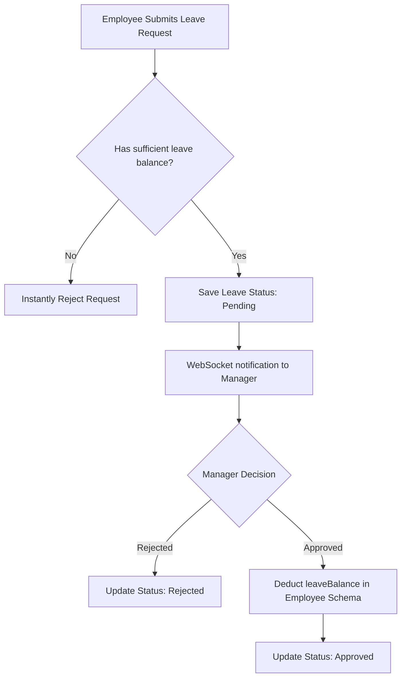

# Modules & Feature Documentation

This document describes the business rules, data flows, and engineering details for each functional module within the **Enterprise Workforce Management (EWM)** system.

---

## 1. HR & Employee Directory Module

### Business Objective
Manage the lifecycle of an employee from onboarding through training, status changes, and final offboarding.

### Onboarding Wizard Workflow
Upon first login, new hires are routed through an **Onboarding Wizard** (`OnboardingWizard.jsx`). 
1. **Step 1: Profile Completeness**: Checks that core details (bio, education, skills, and details) are populated.
2. **Step 2: Document Upload**: Uploads scanning files (ID, proof of address, agreements) to `/uploads`.
3. **Step 3: Policy Acknowledgement**: Checks off standard terms of conduct.
Each step triggers a PUT request to `/api/v1/hr/employees/me/onboarding`, updating the checklists inside the `Employee` model.

### Key DB Operations
* **Archive Employee**: To preserve historical log continuity (like payroll runs), employees are not hard deleted. Instead, the `status` is set to `Archived` (or `Exited`), and their `User` account status is deactivated.

---

## 2. Time, Attendance, & Leave Module

### Shift Attendance Flow
* **Clock-In**: Initiates a new `Attendance` record for today with `clockIn = new Date()`. The system compares the clock-in timestamp against their assigned shift. If clock-in is past the shift start time, the status is set to `Late`.
* **Clock-Out**: Updates the current daily record with `clockOut = new Date()`, calculates `hoursWorked = clockOut - clockIn`, and marks the daily state as `Present` or `Half-day` (if they worked under 4 hours).

### Leave Approval & Balance Workflow

* **Deduction Rule**: Once approved, the system calculates the number of working days between `startDate` and `endDate` (inclusive) and subtracts that count from the employee's `leaveBalance` (casual, sick, or earned).

---

## 3. Automated Payroll Ledger

### Business Objective
Eliminate payroll errors by calculating, generating, and auditing employee pay logs.

### Monthly Payroll Computations
Payroll is generated for all active employees for a target month and year via `POST /api/v1/time-payroll/payroll/process`.
1. **Fetch Base Salary**: Fetches the gross salary from the employee's profile.
2. **Deduct Unpaid Leaves**: Counts approved leaves with status `Absent` or unpaid time off during the month, calculating:
   $$\text{Leave Deduction} = \left(\frac{\text{Salary}}{30}\right) \times \text{Unpaid Days}$$
3. **Compute Net Pay**:
   $$\text{Net Pay} = \text{Base Salary} + \text{Bonuses} - \text{Deductions}$$
4. **PDF Generation**: Generates a payslip using the `jspdf` / `jspdf-autotable` engine on the client side, allowing employees to download payslips locally.

---

## 4. Resource Allocation & Asset Management

### Hardware Allocation
Administers corporate physical hardware (laptops, mobile phones, security keys).
* **Asset Lifecycle States**: `Available` $\rightarrow$ `Assigned` $\rightarrow$ `Under Maintenance` $\rightarrow$ `Disposed`.
* **Assignment Action**: Links the asset record to an employee's ObjectId. This renders the hardware inside the employee's dashboard profile, ensuring physical accountability.

---

## 5. Helpdesk Support Ticketing

### Ticketing Workflow
* **Creation**: Employees submit support tickets, categorizing them into `IT`, `HR`, `Facilities`, or `Finance`.
* **Routing**: The system assigns the ticket to default administrators matching that category (e.g. IT tickets route to `IT_ADMIN` users).
* **Resolution**: Support agents post messages in the ticket comments section, update statuses (`Open`, `In Progress`, `Resolved`, `Closed`), and trigger notification WebSocket broadcasts to the ticket creator.

---

## 6. AI Policy & Assistant Chat

### Gemini Integration
Provides employees with a smart assistant to retrieve policy answers and check system records (e.g. "What is my remaining sick leave balance?").
* **Process**:
  1. The user enters a question.
  2. The controller (`backend/src/modules/ai/`) gathers system context (retrieving the employee's name, leave balances, department policies, and rules).
  3. The controller binds the question and context into a prompt.
  4. The prompt is sent to the Gemini API, returning the response to the user.
