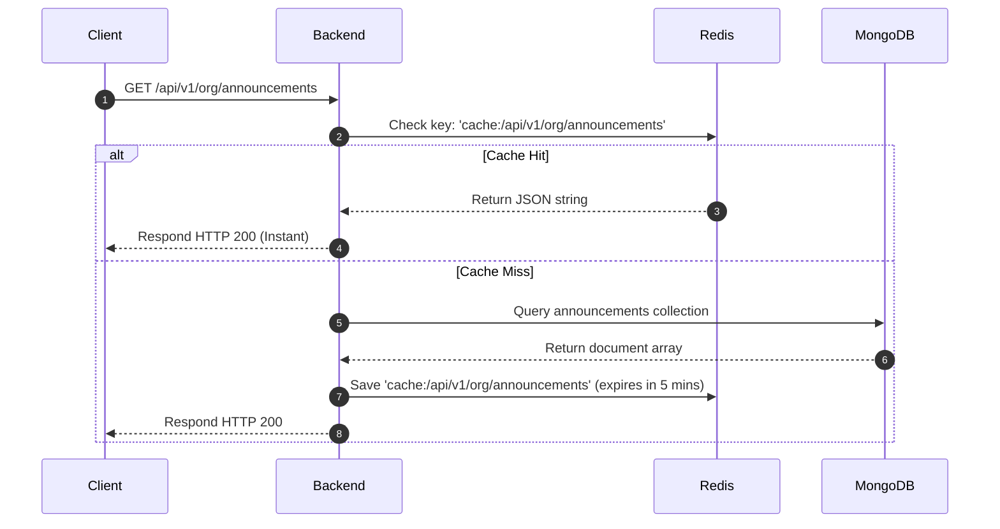

# State Management & Caching Architecture

This document describes how state is shared, stored, and synchronized between the client browser and the server.

---

## 1. Client-Side State Strategy

EWM implements a **Lightweight Client-Side State** pattern. Rather than loading heavy state management libraries like Redux, Zustand, or MobX, the application relies on:
1. **React Component State (`useState`)**: Stores scoped UI variables (like modal open flags, active search fields, and loaded lists).
2. **React Effects (`useEffect`)**: Automates API fetches on view mounts, loading fresh data directly from endpoints.
3. **Browser Local Storage (`localStorage`)**: Persists session credentials and security clearances.

### LocalStorage Schema

| Key | Type | Description |
| :--- | :--- | :--- |
| `userToken` | String | Encrypted JWT signature attached to HTTP request headers. |
| `userRole` | String | Legacy string role (e.g. `SUPER_ADMIN`). |
| `userPermissions` | Array of Strings | Flattened capability tokens checked by `usePermissions` hooks. |
| `userId` | String | The unique employee profile identifier. |

---

## 2. Server-Side Caching (Redis)

Because the client does not maintain a complex global cache, frequent reads (like loading announcements, checking department metrics, or loading employees list) would ordinarily saturate the MongoDB cluster.

To mitigate this, EWM delegates data caching to a high-speed **Redis memory database**.

### The Caching Interceptor Workflow

### Cache Invalidation Rules
When administrators perform mutations (such as editing an announcement or modifying an employee), the cache keys related to those endpoints are purged to prevent dirty reads.
* **Write Action**: `POST /api/v1/org/announcements`
* **Trigger**: Purges the cache key `cache:/api/v1/org/announcements*`.
* **Result**: The next client view mount triggers a cache miss, pulling the updated announcement record from MongoDB.
