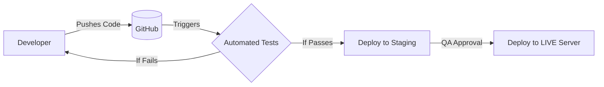

# Deployment & Scalability Strategy

To take the Enterprise Workforce Management platform from a local development environment to a live, enterprise-grade application capable of handling thousands of users, we need a robust deployment and scaling strategy. 

Here is our blueprint for going live.

---

## 1. Hosting Architecture (Where it lives)
We will split the application into three independent tiers. This ensures that if the frontend gets high traffic, it doesn't crash the backend, and vice versa.

*   **Frontend (React/Vite):** 
    *   **Host:** Vercel or Netlify.
    *   **Why:** These platforms use Global CDNs (Content Delivery Networks). When a user in London opens the app, the UI is loaded from a server in London, making it lightning fast.
*   **Backend (Node.js/Express):** 
    *   **Host:** Render, Heroku, or AWS (Elastic Beanstalk / ECS).
    *   **Why:** These platforms allow us to instantly scale up our server resources (CPU/RAM) with the click of a button when traffic spikes.
*   **Database (MongoDB):**
    *   **Host:** MongoDB Atlas (Managed Cloud Database).
    *   **Why:** Atlas automatically handles automated backups, security, and scaling without us having to manage complex database servers.

---

## 2. Making the App Scalable (Handling heavy traffic)

As the company grows, the system needs to handle thousands of employees clocking in at the exact same time (e.g., 9:00 AM rush). Here is how we handle it:

### A. Horizontal Scaling (Adding more servers)
Instead of buying one massive server (Vertical Scaling), we will run multiple smaller instances of our Node.js backend. 
*   **Load Balancer:** A load balancer will sit in front of our backend servers and distribute the 9:00 AM traffic evenly across all of them so no single server gets overwhelmed.
*   **Stateless Authentication:** Because we use **JWT (JSON Web Tokens)** for login, our backend is "stateless". This means if Server A crashes, Server B can instantly take over the user's session without forcing them to log in again.

### B. Socket.IO Scaling (Real-time limits)
Currently, WebSockets keep an active connection on a single server. If we have multiple backend servers, we will need to add a **Redis Adapter**. This allows a WebSocket connection on Server A to send a notification to a user connected to Server B.

### C. Database Optimization
*   **Indexing:** We will add Indexes to our MongoDB collections (e.g., indexing `employeeId` or `date` in the Attendance table). This turns a database search that takes 2 seconds into one that takes 0.02 seconds.
*   **Caching (Redis):** For data that rarely changes (like the list of Departments or Company Holidays), we will store it in a temporary fast-memory cache (Redis). This prevents the database from working too hard on simple, repetitive questions.

---

## 3. The CI/CD Pipeline (Safe Deployments)
We will never manually copy-paste code to the live server. We will set up **Continuous Integration / Continuous Deployment (CI/CD)** using GitHub Actions.

*   **Staging Environment:** Before any code goes to the real users, it will automatically deploy to a "Staging" URL. We test it there to catch bugs.
*   **Zero-Downtime Deployments:** When we update the live app, the system will spin up the new version in the background, and only switch users over once it is fully ready. The app never goes offline during an update.

---

## 4. Monitoring & Security
*   **Error Tracking (Sentry):** If an employee experiences a bug or a crash, Sentry will instantly alert our developers with the exact line of code that failed.
*   **Rate Limiting:** We will add a rate-limiter to the backend to prevent malicious bots from spamming the login or clock-in endpoints (DDoS protection).
*   **HTTPS & Environment Variables:** All traffic will be encrypted via SSL/HTTPS, and all secret keys (like Database URLs and JWT Secrets) will be injected directly into the cloud servers, never stored in the code.
