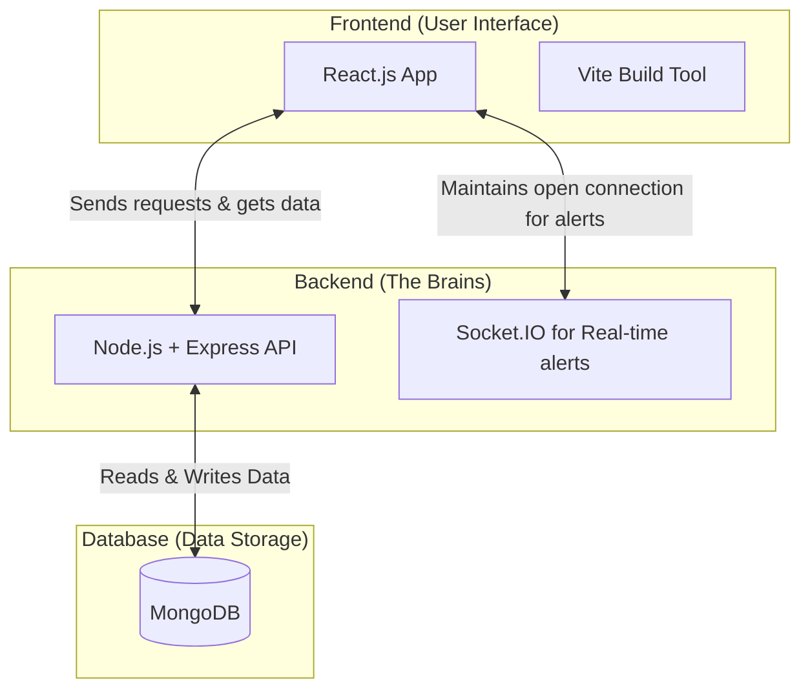
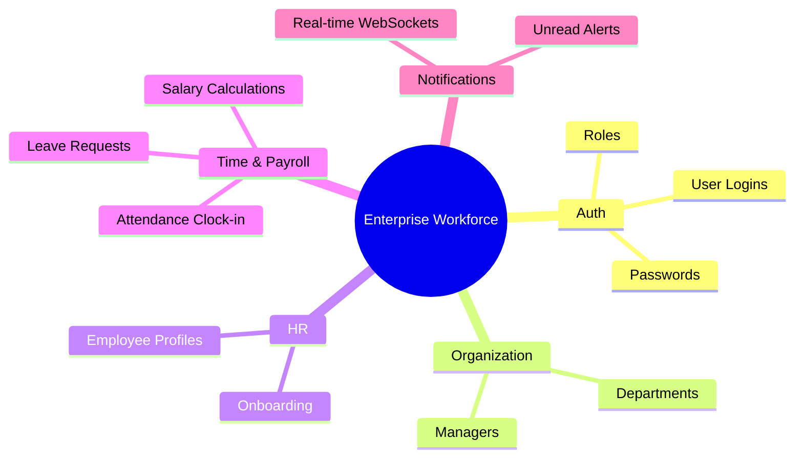
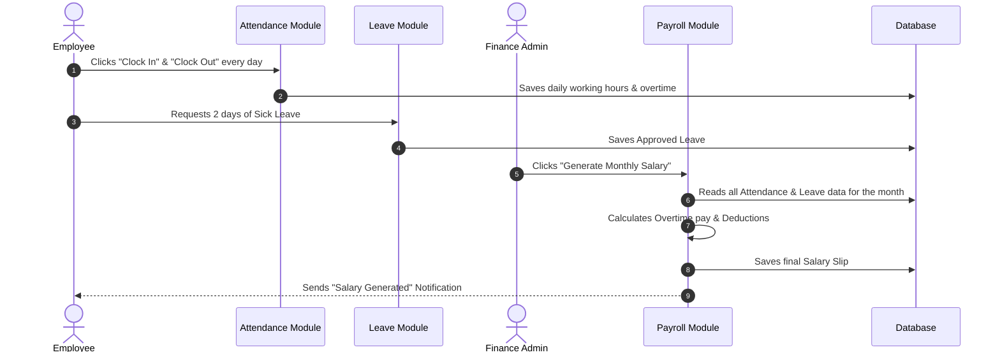
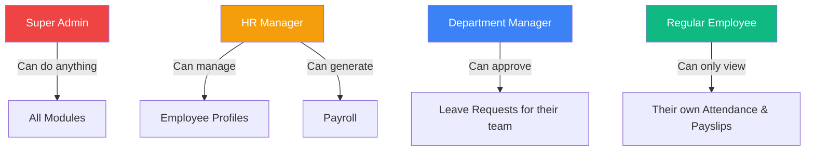

# Project Onboarding Guide: Enterprise Workforce Management

Welcome to the **Enterprise Workforce Management Platform**! 

If you are new to this project, this document is designed to get you up to speed quickly. We will use simple language and diagrams to explain what this platform is, how it works, and what we have built so far.

---

## 1. What is this project?
Imagine a company with hundreds of employees. Keeping track of who works when, approving vacations, calculating monthly salaries, and managing company departments is a massive headache if done using spreadsheets. 

This platform is a **Cloud Software (SaaS)** that digitizes all of those HR and business operations into one single website.

---

## 2. High-Level Architecture
The project is built using the **MERN Stack**. This is a popular way to build web applications by splitting them into three separate layers:

*   **Frontend (React):** This is what the user sees and clicks on (buttons, dashboards). It asks the backend for information.
*   **Backend (Express API):** This is the "brain". When the frontend asks a question (e.g., "Can I log in?"), the backend checks the rules and answers.
*   **Database (MongoDB):** This is the filing cabinet. It securely stores all employee records, passwords, and salaries.

---

## 3. What Have We Built So Far? (Phase 1)
We are currently building **Phase 1** of the project. We have divided the backend into distinct "Domains" or "Modules" so that the code stays clean and organized.

Here is the structure of what is currently working on the backend:

### Detailed Breakdown:
1.  **Authentication (`auth`):** Handles secure logins. It gives users a special digital "key" (called a JWT) so they can access the system.
2.  **Organization (`org`):** Allows administrators to create company departments (like "Engineering" or "Sales").
3.  **HR (`hr`):** The core employee directory. When HR hires someone, they create a profile here, which automatically generates a user login for that person.
4.  **Time & Payroll (`time-payroll`):** 
    *   **Attendance:** Employees click "Clock In" and "Clock Out". The system automatically calculates how many hours they worked and if they did overtime.
    *   **Leave:** Employees can ask for a day off. Managers can approve or reject it.
    *   **Payroll:** At the end of the month, Finance clicks a button, and the system looks at the Attendance and Leave data to automatically calculate the final paycheck!
5.  **Notifications (`notifications`):** Uses a technology called "WebSockets" to push live alerts to a user's screen instantly (like a Facebook notification).

---

## 4. How the Data Flows (Example: Getting Paid)
To understand how the modules talk to each other, let's look at the lifecycle of generating a monthly salary:

---

## 5. Role-Based Access Control (RBAC)
Security is very important. Not everyone can see everything. The system uses "Roles" to decide who gets access.

---

## 6. What's Next?
We have completely finished writing the **Backend "Brains"** for all of these features. 

The immediate next step is **"Wiring up the Frontend"**. We have the visual React screens (the buttons and tables), but we need to connect those buttons so they actually talk to our Backend API. 

Once that is done, we will move on to **Phase 2**, which will introduce an AI Assistant, Recruitment Tracking, and IT Help Desk features!
